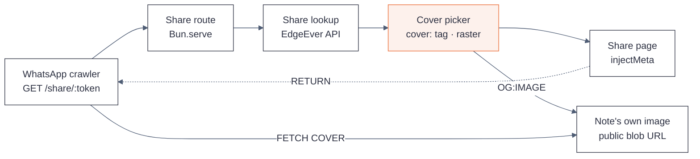

# Changelog

Fork releases of `sharvinzlife/edgeever`, a fork of [`tianma-if/edgeever`](https://github.com/tianma-if/edgeever).
This fork is not affiliated with, authorized, or endorsed by the EdgeEver maintainers.

## Versioning

Fork versions are `<upstream-version>-fork.<n>`, where `<upstream-version>` is the upstream release
this fork is built on. `v1.81.0-fork.1` therefore means: the first fork release on top of upstream
`v1.81.0`.

**Fork releases are tag-only.** `package.json` and `release-summary.json` are left untouched at the
upstream version so that upstream syncs never conflict on them. The consequence is deliberate and
worth stating plainly: the in-app version screen still reports `1.81.0`. The fork tag — not the app —
is the record of what changed.

---

## v1.81.0-fork.4

Base: upstream [`v1.81.0`](https://github.com/tianma-if/edgeever/releases/tag/v1.81.0).

Fixes a share that previewed with a title and description but **no image**.

### Fixed

- **`og:image` now points at a preview-sized derivative instead of the full-size upload.** One share
  previewed without an image while every other share previewed fine. Measured: its cover was
  **1,073,160 bytes** (1440x1800, progressive JPEG — the Instagram photo `/sd` attached at full size),
  while the shares that worked measured 163,613 and 348,310 bytes. WhatsApp is widely reported to drop
  `og:image` somewhere above ~600 KB (undocumented, not a regression in this fork). A 1.07 MB cover is
  simply too large to unfurl.

### Added

- **`GET /api/public/shares/:token/resources/:id/preview`** — a preview-sized derivative, with exactly
  the same share-token and password rules as the `/blob` route it sits beside. Locked shares serve no
  image, as before. Non-image resources are streamed through untouched.
- **The derivative is at most 1200px on the long edge, baseline JPEG, targeting 300 KB.** Quality steps
  down 82 → 70 → 60 and stops at the first result within target; the hard fail-safe is 600 KB. For the
  failing share the ladder lands at Q70 / 213,549 bytes / 960x1200.
- **An in-memory cache** keyed by resource id plus source size, so a crawler hitting the same share
  repeatedly pays for one resize rather than one per unfurl. Bounded at 32 entries (~10 MB).
- **`image-preview-contract.ts`** — the platform-neutral half (constants, types, cache). The libvips
  implementation lives in `image-preview.ts` and reaches the route as an **injected `renderPreview`
  binding**, the same way `storage` and `publicNetworkFetch` do. This is not cosmetic: `apps/api` is
  bundled for the Cloudflare Worker too, and importing `node:child_process` there fails the Worker
  build. Where no renderer is injected — the Worker — the route serves the original bytes, which is
  exactly the previous behaviour.

### Changed

- **`vips-tools` is installed in the runtime stage, pinned to `8.16.1-r0`** to match the pinned Alpine
  3.22 base. libvips rather than `sharp` because the runtime ships a single bundled server file with no
  npm dependency tree at all, so a native npm module could not be loaded there; an Alpine package adds
  a real binary with no bundling step. `vips-tools` is built for musl and aarch64, which is what the
  on-host OCI build needs.

### Notes

- **The original upload and the note are never modified.** `/blob` still serves the untouched bytes
  (verified: 1,526,803 in, 1,526,803 out), and `/sd` still attaches photos at full size.
- **Transparency is flattened onto white**, not black. libvips composites a dropped alpha channel onto
  black by default, so a transparent logo would have previewed as a black box. (`jpegsave
  --background` does *not* do this — it is a save option, not a composite.)
- **Resizing failure is never a broken image.** `renderPreview` logs and returns null; the route then
  serves exactly what `/blob` serves.
- A cover already under the caps is still re-encoded at up to 1200px. The derivative is the contract;
  the ladder is what keeps it small.

### Testing

- `bun test` — **2153 pass, 1 fail** with HEAD exactly on the fork tag, the failure being upstream's
  `build-metadata` tag-only check described under [Versioning](#versioning); **2154 pass, 0 fail** one
  commit off it. 19 tests added.
- `bun run typecheck` — clean.
- **Local proof** (real server, real share, `WhatsApp/2.23.20.0`): source 1,526,803 bytes 1440x1800
  progressive → `og:image` at the `/preview` route → `http_code=200 size_download=213549
  content_type=image/jpeg pixel_dims=960x1200 jpeg_scan=baseline`; `/blob` unchanged at 1,526,803.
- **Live proof** on the originally-failing share and two that already worked — see the release notes.

---

## v1.81.0-fork.3

Base: upstream [`v1.81.0`](https://github.com/tianma-if/edgeever/releases/tag/v1.81.0).

Adds the read path the WhatsApp bot's `/cv` command needs. The `cover:` tag convention from `fork.1`
already *works*; what was missing was any way for an API-token caller to learn which note a share link
points at.

### Added

- **`GET /api/v1/shares/:token` — resolve a share token to its note.** Guarded by the `read:memos`
  scope (an API token, not an interactive session — `requireUser` rejects tokens, and the bot
  authenticates with a Bearer token). Returns
  `{ share: { memoId, title, contentJson, tags, passwordProtected, updatedAt } }`.
- **`contentJson` is the point of the endpoint.** No authenticated route returned the Tiptap document:
  `GET /api/v1/memos/:id` answers Markdown only. Returning just `{ memoId }` would have forced the
  caller to re-read the note through the *public* share route, which answers `403
  share_password_required` on a locked share — and the instance owner is exactly the caller that
  should not be blocked by its own password. One authenticated call returns everything the picker
  needs, for locked shares included.
- The response deliberately omits `memoShareTokens` (that map is keyed by *linked* notes, not this
  one) and never exposes `password_hash` — only the `passwordProtected` boolean.

### Notes

- **Unknown, malformed and other-workspace tokens answer an identical `404`.** The lookup is scoped to
  the caller's workspace, so the endpoint cannot be used to probe for tokens outside it.
- **A tags-only `PATCH /api/v1/memos/:id` needs no edit session** (EdgeEver gates HTTP 428 on a
  content update only), which is how `/cv` writes its `cover:` tag. Two consequences the bot has to
  absorb, both verified in `apps/api/src/memo-service.ts`: the tag array is **replaced wholesale**
  (`input.tags === undefined ? current : normalizeTags(input.tags)`), and `normalizeTags` caps the list
  at **24** tags — so the cover tag must be written first, not appended. A tags-only PATCH also still
  bumps `revision` and records a revision snapshot even though the content is byte-identical, so a
  desktop or mobile client holding an edit session on that note will answer `409` on its next save and
  must reload.

### Testing

- `bun test apps/api/src/share-routes.test.mjs` — 12 pass, 0 fail (5 new: owner resolve, locked-share
  resolve, unknown/malformed/foreign-workspace 404, deleted-note 404, missing-scope 403).
- `bun run typecheck` — clean.

---

## v1.81.0-fork.2

Base: upstream [`v1.81.0`](https://github.com/tianma-if/edgeever/releases/tag/v1.81.0).

### Fixed

- **The default cover no longer picks an SVG served from an extension-less URL.** The raster
  preference added in `fork.1` tested the URL for a `.svg` suffix, which misses the endpoints that
  serve `image/svg+xml` without ever naming it: `img.shields.io` badges and
  `deploy.workers.cloudflare.com/button`. The test is now inverted — a src is renderable only if it
  names a raster format (`.png`, `.jpg`, `.jpeg`, `.webp`, `.gif`, `.avif`, `.bmp`) or is an upload
  the app serves from its own resource route. A file extension is a filename convention, not the
  media type a server will send, so the picker now only gambles on types it can name.

### Changed

- `SVG_SRC` is gone; `isRenderableSrc()` replaces it. `.svg` is no longer special-cased — it fails the
  positive test like any other unnamed type.

### Testing

- `bun test` — 2134 pass, 0 fail (35 in `scripts/og-preview.test.mjs`, up from 29).
- `bun run typecheck` — clean.
- **Validated against the live corpus before shipping:** replaying both predicates over all 30 shares
  on the deployed instance changes exactly one pick — the EdgeEver note moves off a shields.io badge
  and onto its own first image — with no other share affected.

### Known consequence of tag-only releases

Upstream's `tests/build-metadata.test.ts` asserts that `package.json` equals the checked-out release
tag. Under the tag-only convention the tag is `1.81.0-fork.<n>` while the file stays at upstream
`1.81.0`, so **that one test fails while HEAD is exactly on a fork tag** and passes again on the next
commit — the test's own `if (!currentReleaseTag) return;` guard clears it. Verified both ways:
2134 pass / 1 fail on the tag, 2135 pass / 0 fail one commit off it. This follows from the version
split described under [Versioning](#versioning).

No CI is affected. Upstream's release workflows are gated on `github.repository == 'tianma-if/edgeever'`,
so publishing a fork Release runs nothing that executes the test suite.

---

## v1.81.0-fork.1

Base: upstream [`v1.81.0`](https://github.com/tianma-if/edgeever/releases/tag/v1.81.0).

Share links now emit Open Graph and Twitter Card metadata, so a link posted to WhatsApp (or any other
crawler) previews the note's own cover image instead of the application icon.

### Added

- **Server-side preview metadata for `GET /share/<token>`.** A social crawler does not execute
  JavaScript, so the tags are injected into the page shell on the server before it is returned:
  `og:type`, `og:title`, `og:description`, `og:url`, `og:image`, and `twitter:card`. When a note has
  no cover the `og:image` tag is omitted and the card degrades to `summary`.
- **`cover:<src>` tag convention.** Tag a note `cover:res_<id>` (or `cover:<full image src>`) to pin
  the preview to one specific image. The tag is the reserved interface for a future WhatsApp bot
  command that lists a note's images and lets the sender pick one by number.
- **Raster-preferred default cover.** When no `cover:` tag is present the cover is the first image
  in the note — skipping SVG, because crawlers do not render it. A note whose *only* image is an SVG
  still uses that image; there is nothing better to offer.
- **`docs/diagrams/edgeever-og-preview.svg`** — architecture diagram of the preview pipeline
  (with an `.html` companion page).

### Fixed

- **`og:description` no longer blanks underscores.** The previous implementation treated `_` as a
  Markdown emphasis marker, so a body containing `res_530dc5f2…` previewed as `res 530dc5f2…`.
- **`og:description` no longer leaks link Markdown.** `[the docs](https://…)` now renders as
  `the docs`; previously the raw Markdown reached the preview text.

### Changed

- **`describeShare()` extracted into `scripts/og-preview.mjs`.** The description builder was an
  inline arrow function inside the server, where no unit test could reach it — which is precisely why
  the two defects above shipped. It is now a pure, exported function with its own tests.

### Testing

- `bun test` — 2129 pass, 0 fail (up from 2120; 9 new tests in `scripts/og-preview.test.mjs`).
- `bun run typecheck` — clean.

### The cover rule

One constraint governed this whole change and is worth stating, because it is a promise to note
authors rather than an implementation detail: **the cover is never a copy.** The preview always
points at an image the note already contains, at its original URL — an external link verbatim, or an
uploaded attachment at its own public EdgeEver blob URL. Nothing is re-hosted, re-encoded, or
uploaded anywhere. Only the link preview changes; the note's body and assets are never touched.

