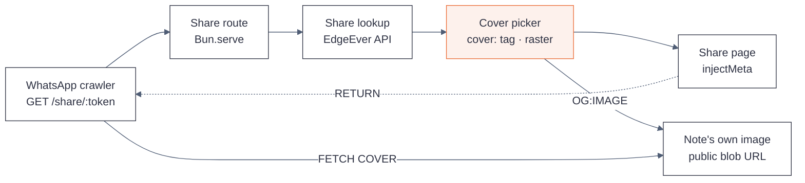

# Changelog

Fork releases of `sharvinzlife/edgeever`, a fork of [`tianma-if/edgeever`](https://github.com/tianma-if/edgeever).
This fork is not affiliated with, authorized, or endorsed by the EdgeEver maintainers.

## Versioning

Fork versions are `<upstream-version>-fork.<n>`, where `<upstream-version>` is the upstream release
this fork is built on. `v1.81.0-fork.1` therefore means: the first fork release on top of upstream
`v1.81.0`.

**Fork releases are tag-only.** `package.json` and `release-summary.json` are left untouched at the
upstream version so that upstream syncs never conflict on them. The consequence is deliberate and
worth stating plainly: the in-app version screen still reports `1.81.0`. The fork tag — not the app —
is the record of what changed.

---

## v1.81.0-fork.2

Base: upstream [`v1.81.0`](https://github.com/tianma-if/edgeever/releases/tag/v1.81.0).

### Fixed

- **The default cover no longer picks an SVG served from an extension-less URL.** The raster
  preference added in `fork.1` tested the URL for a `.svg` suffix, which misses the endpoints that
  serve `image/svg+xml` without ever naming it: `img.shields.io` badges and
  `deploy.workers.cloudflare.com/button`. The test is now inverted — a src is renderable only if it
  names a raster format (`.png`, `.jpg`, `.jpeg`, `.webp`, `.gif`, `.avif`, `.bmp`) or is an upload
  the app serves from its own resource route. A file extension is a filename convention, not the
  media type a server will send, so the picker now only gambles on types it can name.

### Changed

- `SVG_SRC` is gone; `isRenderableSrc()` replaces it. `.svg` is no longer special-cased — it fails the
  positive test like any other unnamed type.

### Testing

- `bun test` — 2134 pass, 0 fail (35 in `scripts/og-preview.test.mjs`, up from 29).
- `bun run typecheck` — clean.
- **Validated against the live corpus before shipping:** replaying both predicates over all 30 shares
  on the deployed instance changes exactly one pick — the EdgeEver note moves off a shields.io badge
  and onto its own first image — with no other share affected.

### Known consequence of tag-only releases

Upstream's `tests/build-metadata.test.ts` asserts that `package.json` equals the checked-out release
tag. Under the tag-only convention the tag is `1.81.0-fork.<n>` while the file stays at upstream
`1.81.0`, so **that one test fails while HEAD is exactly on a fork tag** and passes again on the next
commit — the test's own `if (!currentReleaseTag) return;` guard clears it. This is inherent to the
version split described under [Versioning](#versioning), and it is why the fork does not push a
release tag that CI must build green.

---

## v1.81.0-fork.1

Base: upstream [`v1.81.0`](https://github.com/tianma-if/edgeever/releases/tag/v1.81.0).

Share links now emit Open Graph and Twitter Card metadata, so a link posted to WhatsApp (or any other
crawler) previews the note's own cover image instead of the application icon.

### Added

- **Server-side preview metadata for `GET /share/<token>`.** A social crawler does not execute
  JavaScript, so the tags are injected into the page shell on the server before it is returned:
  `og:type`, `og:title`, `og:description`, `og:url`, `og:image`, and `twitter:card`. When a note has
  no cover the `og:image` tag is omitted and the card degrades to `summary`.
- **`cover:<src>` tag convention.** Tag a note `cover:res_<id>` (or `cover:<full image src>`) to pin
  the preview to one specific image. The tag is the reserved interface for a future WhatsApp bot
  command that lists a note's images and lets the sender pick one by number.
- **Raster-preferred default cover.** When no `cover:` tag is present the cover is the first image
  in the note — skipping SVG, because crawlers do not render it. A note whose *only* image is an SVG
  still uses that image; there is nothing better to offer.
- **`docs/diagrams/edgeever-og-preview.svg`** — architecture diagram of the preview pipeline
  (with an `.html` companion page).

### Fixed

- **`og:description` no longer blanks underscores.** The previous implementation treated `_` as a
  Markdown emphasis marker, so a body containing `res_530dc5f2…` previewed as `res 530dc5f2…`.
- **`og:description` no longer leaks link Markdown.** `[the docs](https://…)` now renders as
  `the docs`; previously the raw Markdown reached the preview text.

### Changed

- **`describeShare()` extracted into `scripts/og-preview.mjs`.** The description builder was an
  inline arrow function inside the server, where no unit test could reach it — which is precisely why
  the two defects above shipped. It is now a pure, exported function with its own tests.

### Testing

- `bun test` — 2129 pass, 0 fail (up from 2120; 9 new tests in `scripts/og-preview.test.mjs`).
- `bun run typecheck` — clean.

### The cover rule

One constraint governed this whole change and is worth stating, because it is a promise to note
authors rather than an implementation detail: **the cover is never a copy.** The preview always
points at an image the note already contains, at its original URL — an external link verbatim, or an
uploaded attachment at its own public EdgeEver blob URL. Nothing is re-hosted, re-encoded, or
uploaded anywhere. Only the link preview changes; the note's body and assets are never touched.

